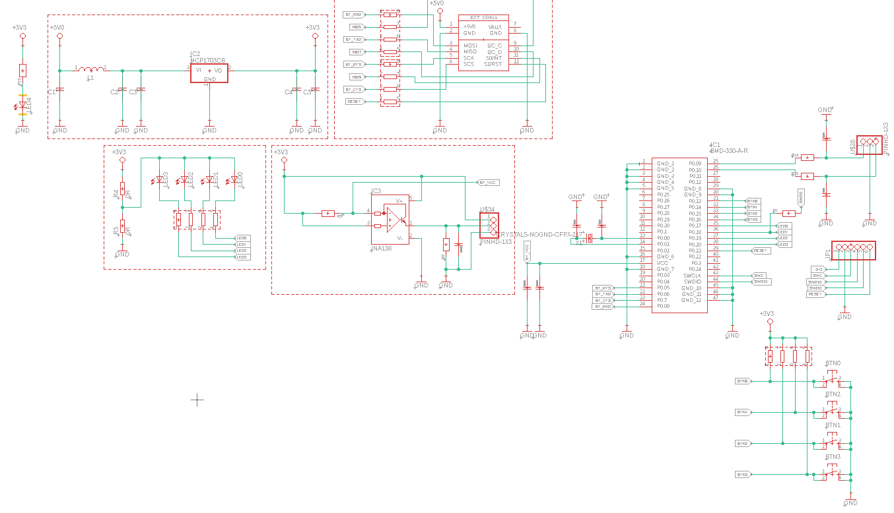
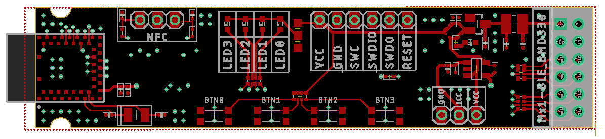

# Expansion odule : BLE BMD330AR

## Overview
This repository hosts the design and implementation of the BLE BMD330AR Expansion Module. The module integrates the BMD-330-A-R, a Bluetooth 5.0 Low Energy module, suitable for a wide range of IoT and automation applications. It connects to the smartboard via a single slot, utilizing four serial port lines: RX, TX, RTS, and CTS, along with two configuration pins.

## Key Features of BMD-330
- **Bluetooth 5.0 Low Energy** for efficient wireless communication.
- **200m Range**: Extensive coverage for various applications.
- **Low Power Consumption**: Under 15.4 mA in Tx mode and less than 10 mA in Rx mode.
- **Multiple Interfaces**: SPI, UART, I2C, GPIO, PWM, and PDM.
- **Compact Size**: Measures 14 x 9.8 x 1.9 mm, ideal for embedded solutions.

## Contributions and Feedback
Contributions to this project are welcome. If you have suggestions for improvement or have developed additional features, please fork the repository, make your changes, and submit a pull request. For any questions or issues, please open an issue in the GitHub repository.

## License
This charger project is licensed under the MIT License with the following terms:

- **Permission to Use**: You are free to use, modify, and distribute this charger design in both private and commercial settings.
- **Attribution Requirement**: While not required, attribution to the original author, Adam Łuczak, is appreciated. This can be done through a citation or a link back to this repository.
- **No Warranty**: This design is provided "as is", without warranty of any kind. Use it at your own risk.
- **Liability**: The author is not liable for any damages or losses that may arise from the use of this design.

For the full terms and conditions, please refer to the MIT License documentation.

## Contact
Should you have any inquiries or suggestions regarding this charger project, please don't hesitate to contact Adam Łuczak at adam.luczak@outlook.com.
